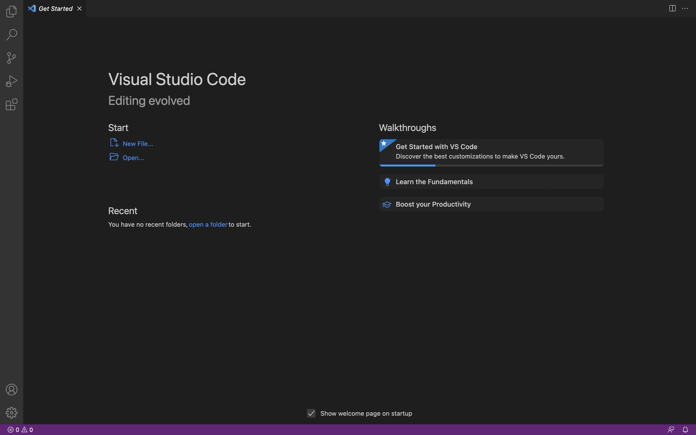
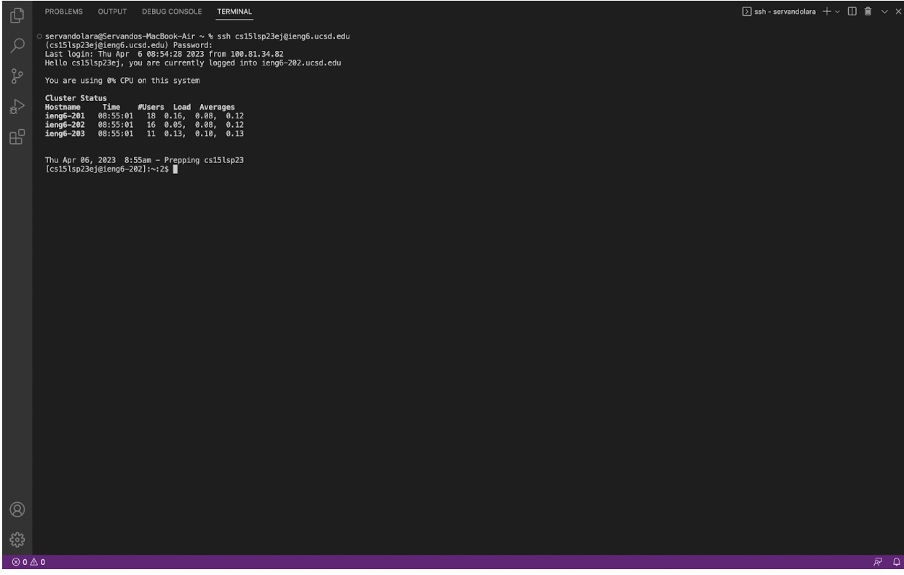
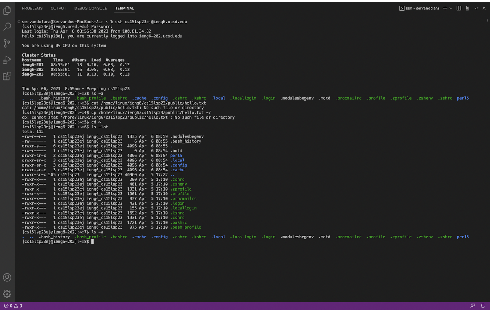

# Lab Report 1
**Step 1: Gathering account info**
- After you are sorted into your groups you will look for your course specific account using this link: [Link](https://sdacs.ucsd.edu/~icc/index.php)
- Instructions with further steps can be found here: [Link](https://drive.google.com/file/d/17IDZn8Qq7Q0RkYMxdiIR0o6HJ3B5YqSW/view)

**Step 2: Installing VS Code**
- The software we will be using for this class will be visual studio code which can be downloaded here: [Link](https://code.visualstudio.com/)
- Once you have it fully installed and open it it should look like the image below



**Step 3: Remote Acess**
- Now that you have vs code and your account info you are ready to use the ssh command to remotely connect to your account from your device
- Open the terminal at the top of vs code using the command below but replazing the ## with the letters that appear in your course specific account
```
$ ssh cs15lsp23##@ieng6.ucsd.edu
```
- Once you hit enter it will ask you for your password which you just reset in step 1.
- The password won't display as you type but if entered correctly the terminal should print print something like the image below but will include a welcome message for your first log in as well as any security notices if you misentered your password while attempting to log in.



**Step 3: Commands**
- Here are some commands you can try running
```
cd ~
cd
ls -lat
ls -a
ls <directory> where <directory> is /home/linux/ieng6/cs15lsp23/cs15lsp23abc, where the abc is one of the other group members’ username
cp /home/linux/ieng6/cs15lsp23/public/hello.txt ~/
cat /home/linux/ieng6/cs15lsp23/public/hello.txt
```
- Once you run a couple you can log out of the remote server using Ctrl-D
- If ran succesfully it should look like the image below


