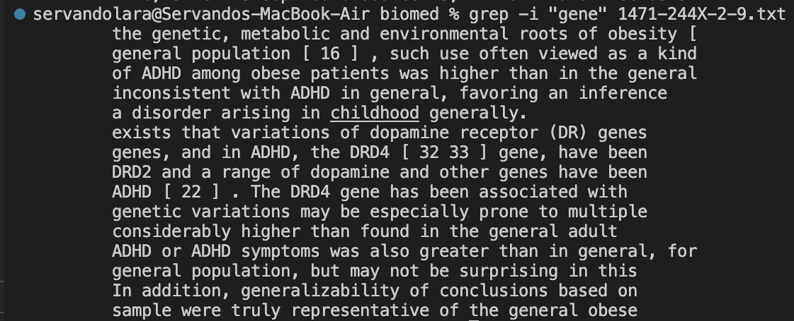
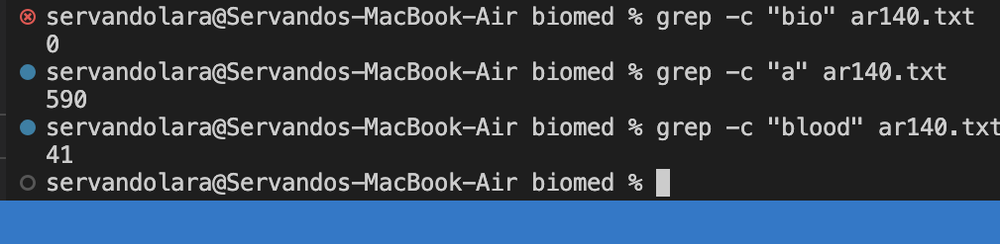
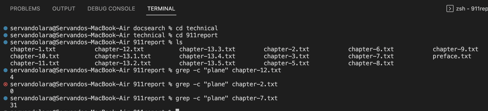
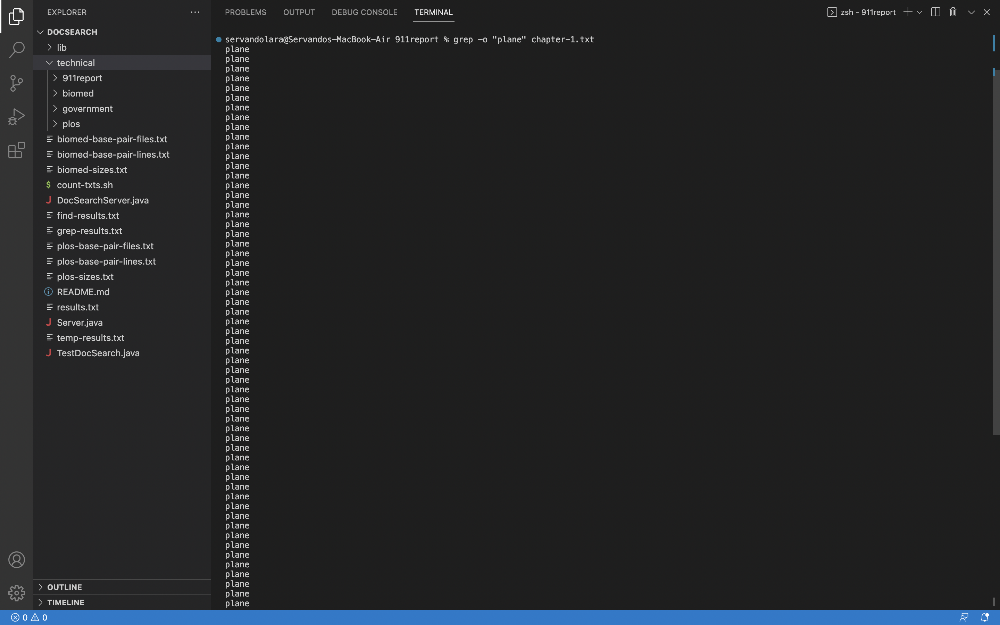
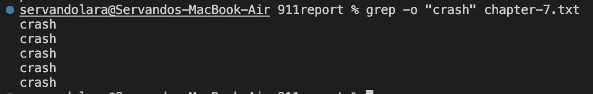
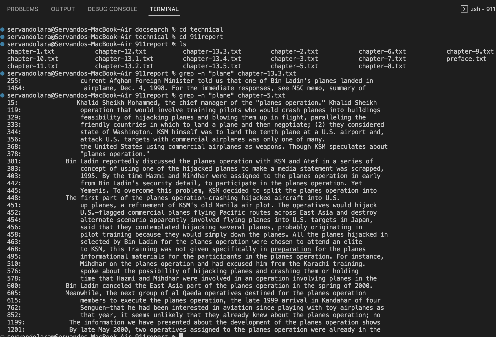
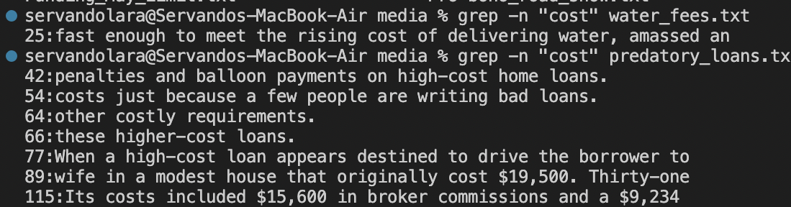

# Lab Report 3
## Four Commands with grep

### Option 1: Case insensitive search
- This version of the grep command enables to search for a string case insensitively in the given file.
- This is helpful becuase you can search for phrases that in big files as shown in the following examples.
- "-i" : Ignores, case for matching
- This is extremely useful because most computer programs are very specific and can cause simple errors.
- grep for example matches only an identical match to the pattern.
- By adding "-i" we can ignore the pattern and match just the phrase, so caps, italics, or any other format that altered a phrase would be ignored.
- As long as the phrase is somewhere in a line even if its a part of a word it will be printed.
- Example 1:
```
$grep -i "blood" ar149.txt
```
- Output:

- Example 2:
```
$grep -i "gene" 1471-244X-2-9.txt
```
- Output:


### Option 2: Displaying the count of number of matches
- With this version of the grep command we can find the number of lines that matches the given string/pattern.
- This is helpful to check how many lines contain a certain word or phrase you are looking for as shown in the following examples.
- This can be helpful when researching for example: When looking for a file that focuses on a certain topic you are researching using this command will return a number of lines that match your search.
- Example 1:
```
grep -c "bio" ar140.txt
grep -c "a" ar140.txt
grep -c "blood" ar140.txt
```
- Output:

- Example 2:
```
grep -c "plane" chapter-12.txt
grep -c "plane" chapter-2.txt
grep -c "plane" chapter-7.txt
```
- Output:


### Option 3: Displaying only the matched pattern
- This version makes grep display only the matched string.
- This can be helpful when looking for a specific word in a big file 
- It won't tell you how many times it appears it will just keep printing one for every line as shown in the following examples.
- This can be used to check for repitition if a long list is returned than a phrase might be used to often.
- Example 1:
```
grep -o "plane" chapter-1.txt
```
- "-o" : Prints only the matched parts of a matching line, with each such part on a separate output line.
- By adding the "-o" it changes from a regular grep printing out the entire lines to just the phrase that was matched.
- Output:

- Example 2:
```
grep -o "crash" chapter-7.txt
```
- Output:


### Option 4: Show line number while displaying the output using grep -n
- The fourth version of grep I found is used to show the line number of file with the line matched.
- This can be extremely helpful for finding the exact location of a word or phrase in a really long file as shown in the following examples.
- Example 1:
```
grep -n "plane" chapter-13.3.txt
grep -n "plane" chapter-5.txt
```
- Output:

- Example 2:
```
grep -n "cost" water_fees.txt
grep -n "cost" predatory_loans.txt
```
- Output:



All commands shown were and can be found on this [Link](https://www.geeksforgeeks.org/grep-command-in-unixlinux/#)
