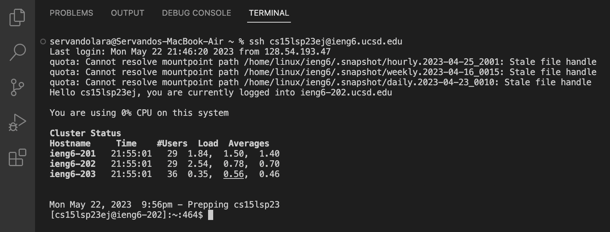
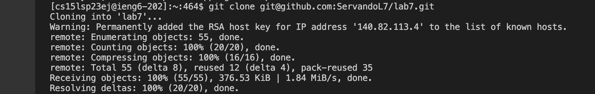
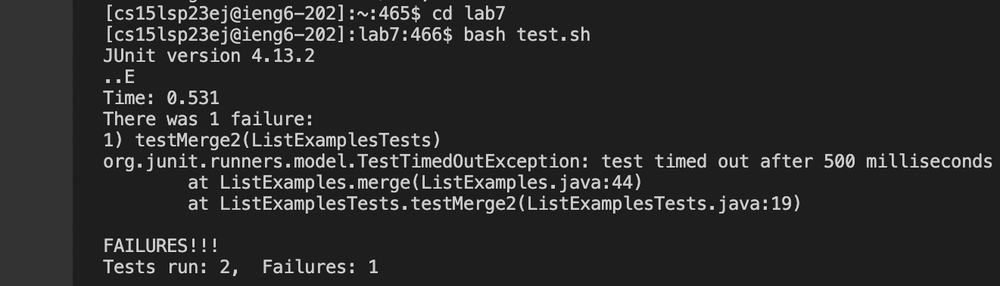
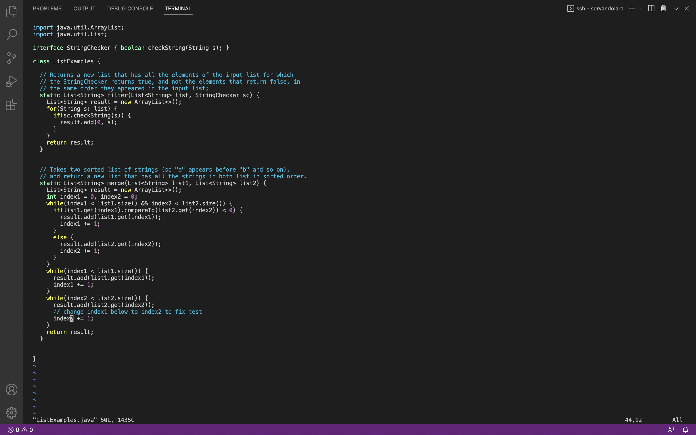
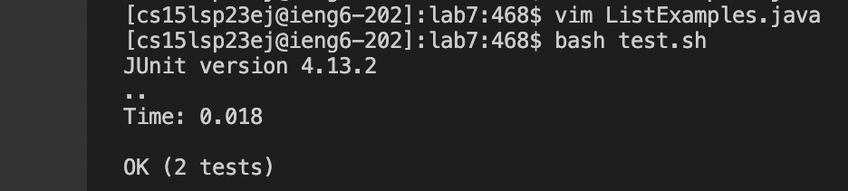
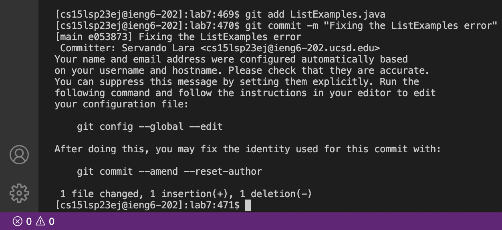

# Lab Report 4
## Doing it all from the command line

### Step 4: Log into ieng6

- This task is the simplest and easiest to complete
- From the local terminal the follwing keys were pressed:

```
<up> <enter>
```

- The command ran was: ```ssh cs15lsp23ej@ieng6.ucsd.edu```



### Step 5: Clone your fork of the repository from your Github account

- Once logged in the next step was cloning the forked respository
- From the ssh terminal the follwing keys were pressed:

```
<up> <up> <up> <up> <up> <up> <up> <up> <up> <up> <up> <up> <enter>
```

- The command ran was: ```git clone git@github.com:ServandoL7/lab7.git```



### Step 6: Run the tests, demonstrating that they fail

- Once the clone was complete I was able to run the test
- From the ssh terminal the follwing keys were pressed:

```
cd lab7 <enter>
<up> <up> <up> <up> <up> <up> <up> <up> <up> <up> <enter>
```

- The command ran was: ```bash test.sh```



### Step 7: Edit the code file to fix the failing test

- The test failed so changes needed to be made
- From the ssh terminal the follwing keys were pressed:

```
<up> <up> <up> <up> <up> <up> <up> <up> <up> <up> <up> <up> <enter>
```

- The command ran was: ```Vim ListExamples.java```
- In vim the follong keys were pressed to make the changes

```
/1 <enter>
<l>
<I>
<backspace>
<2>
<esc>
:wq <enter>
```



### Step 8: Run the tests, demonstrating that they now succeed

- ```:wq``` exits vim and from here we could test if the changes worked
- From the ssh terminal the follwing keys were pressed:

```
<up> <up> <enter>
```

- The command ran was: ```bash test.sh```



### Step 9: Commit and push the resulting change to your Github account

- The tests passed so the last step was commiting
- From the ssh terminal the follwing keys were pressed:

```
<up> <up> <up> <up> <up> <up> <up> <up> <up> <up> <up> <up> <enter>
<up> <up> <up> <up> <up> <up> <up> <up> <up> <up> <up> <up> <enter>
```

- The command ran was: ```git add ListExamples.java``` and ```git commit -m "Fixing the ListExamples error```



### Key Takeaway

- Definitely could have been completed with way lest <up> in each step if there wasn't many "ls" ran in the previous run taking spaces in the history.
