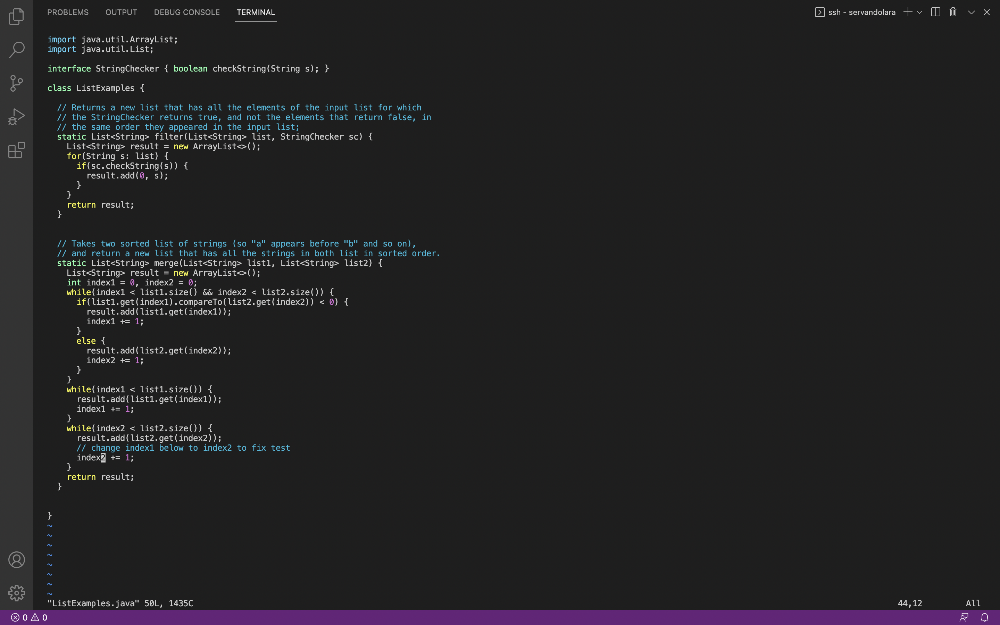

# Lab Report 5
## Debugging Scenario

### The Original Post (Preview):


### The TA's Response:


### What happened after the fix and what was returned:


### Information Needed:

- The Lab7 directory was where it all took place
- Vim was essential to fixing the bug.
- The command ran to trigger the bug was ```bash test.sh```


- The image shows the fixed code which the only change from the original was right under the comment changing the 1 to a 2



## Reflection

In the second half of this quarter I learned how to use Vim and it is such an interesting concept. 
But by far the most shocking thing I learned was how to generate log in keys so that I wasn't promted to enter a password everytime I logged in.
It made remote connecting such an easy task becuase logging in could be a hassle with not being able to see the password.
